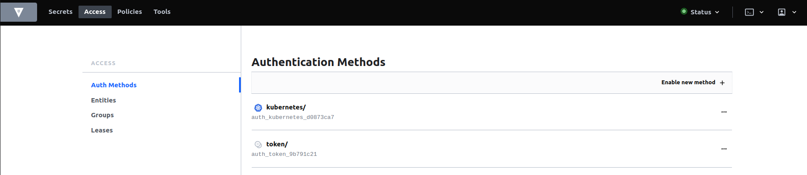
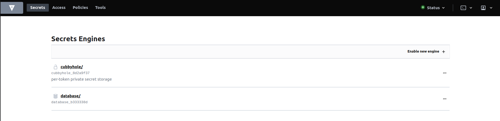

# kubernetes hashiCorp vault

## Summary

This repository come to demonstrate how to integrate kubernetes with hashiCorp vault and generate dynamic credentials for application workload.

Prerequisites - minikube, Helm, kubectl, cfssl.

## Minikube

Create Minikube Cluster

```bash
minikube start -p vault-example --cpus 4 --memory 4096
```

## TLS

We want to create ssl certificate for encrypt data in transit.

01 - Create vault namespace and set the context.

```bash
kubectl create ns vault
kubectl config set-context --current --namespace vault
```

02 - Download cfssl binaries. (cloudflare ssl tool)

```bash
mkdir -p tls/cfssl
curl -L https://github.com/cloudflare/cfssl/releases/download/v1.5.0/cfssl_1.5.0_linux_amd64 -o ./tls/cfssl/cfssl
chmod +x ./tls/cfssl/cfssl
curl -L https://github.com/cloudflare/cfssl/releases/download/v1.5.0/cfssljson_1.5.0_linux_amd64 -o ./tls/cfssl/cfssljson
chmod +x ./tls/cfssl/cfssljson
curl -L https://github.com/cloudflare/cfssl/releases/download/v1.5.0/cfssl-certinfo_1.5.0_linux_amd64 -o ./tls/cfssl/cfssl-certinfo
chmod +x ./tls/cfssl/cfssl-certinfo
```

03 - Create a certificate authority.

```bash
mkdir -p tls/ca && cd ./tls/ca
../cfssl/cfssl gencert -initca ../ca-csr.json | ../cfssl/cfssljson -bare ./ca
```

04 - Create the certificate for vault.

```bash
mkdir -p ../vault && cd ../vault
../cfssl/cfssl gencert \
  -ca=../ca/ca.pem \
  -ca-key=../ca/ca-key.pem \
  -config=../ca-config.json \
  -hostname="vault,vault.vault.svc.cluster.local,vault.vault.svc,localhost,127.0.0.1" \
  -profile=default \
  ../ca-csr.json | ../cfssl/cfssljson -bare ./vault
```

05 - Create the tls secrets on k8s vault namespace

```bash
cd ../..
kubectl -n vault create secret tls tls-ca \
 --cert ./tls/ca/ca.pem  \
 --key ./tls/ca/ca-key.pem

kubectl -n vault create secret tls tls-server \
  --cert ./tls/vault/vault.pem \
  --key ./tls/vault/vault-key.pem

kubectl get secrets
```

```bash
# NAME         TYPE                DATA   AGE
# tls-ca       kubernetes.io/tls   2      0s
# tls-server   kubernetes.io/tls   2      0s
```

### Consul

We want to create a consul manifests to handle our vault storage.

01 - Add consul repository & check versions.

```bash
helm repo add hashicorp https://helm.releases.hashicorp.com
helm search repo hashicorp/consul --versions
```

```bash
# NAME            	CHART VERSION	APP VERSION	DESCRIPTION
# hashicorp/consul	1.3.0        	1.17.0     	Official HashiCorp Consul Chart
# hashicorp/consul	1.2.3        	1.16.3     	Official HashiCorp Consul Chart
# hashicorp/consul	1.2.2        	1.16.2     	Official HashiCorp Consul Chart
```

02 - Generate manifests with the minimum config values.

```bash
helm template consul hashicorp/consul \
  --namespace vault \
  --version 1.3.0 \
  -f ./helm/consul-values.yaml \
  > ./helm/manifests/consul.yaml
```

03 - Apply consul manifests

```bash
kubectl apply -f ./helm/manifests/consul.yaml
watch kubectl get pods
```

```bash
# NAME                                                  READY   STATUS      RESTARTS   AGE
# consul-consul-client-rsjdv                            1/1     Running     0          2m49s
# consul-consul-connect-injector-67ff874b77-tlgzz       1/1     Running     0          2m49s
# consul-consul-gateway-cleanup-vhll8                   0/1     Completed   0          2m49s
# consul-consul-gateway-resources-nwh6s                 0/1     Completed   0          2m49s
# consul-consul-server-0                                1/1     Running     0          2m49s
# consul-consul-test                                    0/1     Completed   0          2m49s
# consul-consul-webhook-cert-manager-579ddb5874-9n55w   1/1     Running     0          2m49s
```

## Vault

Setup Vault Server & kubernetes engine

### Setup Vault Server

01 - Check vault versions.

```bash
helm search repo hashicorp/vault --versions
```

```bash
# NAME                            	CHART VERSION	APP VERSION	DESCRIPTION
# hashicorp/vault                 	0.27.0       	1.15.2     	Official HashiCorp Vault Chart
# hashicorp/vault                 	0.26.1       	1.15.1     	Official HashiCorp Vault Chart
# hashicorp/vault                 	0.26.0       	1.15.1     	Official HashiCorp Vault Chart
```

02 - Generate manifests with config values.

```bash
# Checkout vault-values.yaml to understand how to enable tls mode & inject ssl certificate.
helm template vault hashicorp/vault \
  --namespace vault \
  --version 0.27.0 \
  -f ./helm/vault-values.yaml \
  > ./helm/manifests/vault.yaml
```

03 - Apply vault manifests.

```bash
kubectl apply -f ./helm/manifests/vault.yaml
kubectl get pods
```

```bash
# NAME                                                  READY   STATUS      RESTARTS   AGE
# consul-consul-client-rsjdv                            1/1     Running     0          32m
# consul-consul-connect-injector-67ff874b77-tlgzz       1/1     Running     0          32m
# consul-consul-gateway-cleanup-vhll8                   0/1     Completed   0          32m
# consul-consul-gateway-resources-nwh6s                 0/1     Completed   0          32m
# consul-consul-server-0                                1/1     Running     0          32m
# consul-consul-test                                    0/1     Completed   0          32m
# consul-consul-webhook-cert-manager-579ddb5874-9n55w   1/1     Running     0          32m
# vault-0                                               1/1     Running     0          37s
# vault-agent-injector-5f4c849798-l8p7r                 1/1     Running     0          37s
# vault-server-test                                     1/1     Running     0          37s
```

04 - Vault Server

1.  Initialize vault server

    ```bash
    kubectl exec -it vault-0 -- vault operator init
    ```

    ```bash
    # Unseal Key 1: +hfRjxN79kTbfkwpMat9CGJWzen4YXMZ+XGlW3uI+SiG
    # Unseal Key 2: eg+WdxOc9DdzM+YF66qV0YJvbnobJ2FSRgdc417MKOco
    # Unseal Key 3: 5/DPMs6uiYnN3sxSEoRybErctBuErqU2iOP2pVCrgI+1
    # Unseal Key 4: yb+nONrIIUw2g9zBoFUBUgfJHWbNoQa8HrFREKi946ks
    # Unseal Key 5: DgDATxsWN9KwJ596UUPDI+LBHZ1jg/hX7sMb9l/h0nEW
    # Initial Root Token: s.suJ92WQN6xllJpZzFRznA8Yl
    ```

2.  Unseal the vault.

    ```bash
    # x3
    kubectl exec -it vault-0 -- vault operator unseal
    ```

    ```bash
    # Key                    Value
    # ---                    -----
    # Seal Type              shamir
    # Initialized            true
    # Sealed                 false
    # Total Shares           5
    # Threshold              3
    # Version                1.9.2
    # Storage Type           consul
    # Cluster Name           vault-cluster-c55e7bdc
    # Cluster ID             22c25ceb-2476-9254-7cb5-0b0f181c529b
    # HA Enabled             true
    # HA Cluster             n/a
    # HA Mode                standby
    # Active Node Address    <none>
    ```

3.  Login to vault server & Check vault status & tls mode.

    ```bash
    kubectl exec -it vault-0 -- vault login
    vault status
    ```

    ```bash
    # Key             Value
    # ---             -----
    # Seal Type       shamir
    # Initialized     true
    # Sealed          false
    # Total Shares    5
    # Threshold       3
    # Version         1.9.2
    # Storage Type    consul
    # Cluster Name    vault-cluster-c55e7bdc
    # Cluster ID      22c25ceb-2476-9254-7cb5-0b0f181c529b
    # HA Enabled      true
    # HA Cluster      https://vault-0.vault-internal:8201
    # HA Mode         active
    # Active Since    2023-12-23T19:40:35.544691823Z
    ```

    ```bash
    kubectl logs vault-example-0
    ```

    ```bash
    # We can see tls: "enabled"
    # ==> Vault server configuration:

    #              Api Address: https://10.244.0.12:8200
    #                      Cgo: disabled
    #          Cluster Address: https://vault-0.vault-internal:8201
    #               Go Version: go1.17.5
    #               Listener 1: tcp (addr: "0.0.0.0:8200", cluster address: "0.0.0.0:8201", max_request_duration: "1m30s", max_request_size: "33554432", tls: "enabled")
    #                Log Level: info
    #                    Mlock: supported: true, enabled: false
    #            Recovery Mode: false
    #                  Storage: consul (HA available)
    #                  Version: Vault v1.9.2
    #              Version Sha: f4c6d873e2767c0d6853b5d9ffc77b0d297bfbdf
    ```

### Setup kubernetes engine & authentication

01 - Enable kubernetes engine

```bash
kubectl -n vault exec -it vault-0 -- sh
vault login
vault auth enable kubernetes
```

```bash
## Success! Enabled kubernetes auth method at: kubernetes/
```

02 - Setup kubernetes authentication.

```bash
# This let the injector access to the vault with his service account.
vault write auth/kubernetes/config \
  token_reviewer_jwt="$(cat /var/run/secrets/kubernetes.io/serviceaccount/token)" \
  kubernetes_host=https://${KUBERNETES_PORT_443_TCP_ADDR}:443 \
  kubernetes_ca_cert=@/var/run/secrets/kubernetes.io/serviceaccount/ca.crt
```

```bash
## Success! Data written to: auth/kubernetes/config
```

03 - Optional - check vault server UI.

```bash
kubectl -n vault port-forward svc/vault-ui 8200:8200
```



## Mysql

### Setup Database

01 - Create mysql server

```bash
kubectl create ns mysql
kubectl config set-context --current --namespace mysql
kubectl apply -f ./mysql/
watch kubectl get pods
```

```bash
# NAME                     READY   STATUS    RESTARTS   AGE
# mysql-6c78bd9c8f-tgjt6   1/1     Running   0          37s
```

02 - Create superuser

```bash
kubectl exec -it mysql-6c78bd9c8f-tgjt6 bash
mysql -u root --password=password
```

```bash
# Check users
mysql> select user from mysql.user;
# +------------------+
# | user             |
# +------------------+
# | root             |
# | mysql.infoschema |
# | mysql.session    |
# | mysql.sys        |
# | root             |
# +------------------+
# 5 rows in set (0.00 sec)

# Create superuser (username=superuser password=superuser)
mysql> CREATE USER 'superuser'@'%' IDENTIFIED BY 'superuser';
# Query OK, 0 rows affected (0.04 sec)

mysql> GRANT ALL PRIVILEGES ON *.* TO 'superuser' WITH GRANT OPTION;
# Query OK, 0 rows affected (0.02 sec)

# Check users
mysql> select user from mysql.user;
# +------------------+
# | user             |
# +------------------+
# | root             |
# | superuser        |
# | mysql.infoschema |
# | mysql.session    |
# | mysql.sys        |
# | root             |
# +------------------+
# 6 rows in set (0.00 sec)
```

### Dynamic Secrets

01 - Enable the database engine

```bash
kubectl config set-context --current --namespace vault
kubectl exec -it vault-0 vault -- sh
vault login
vault secrets enable database
```

```bash
## Success! Enabled the database secrets engine at: database/
```



02 - [Configure db credential creation](https://developer.hashicorp.com/vault/api-docs/secret/databases/mysql-maria)

```bash
kubectl -n vault exec -it vault-0 sh

# Configure Database for MYSQL configuration
vault write database/config/mysql-db \
  plugin_name=mysql-database-plugin \
  allowed_roles="mysql-role" \
  connection_url="{{username}}:{{password}}@tcp(mysql.mysql.svc.cluster.local:3306)/" \
  max_open_connections="20" \
  max_connection_lifetime="7200s" \
  username="superuser" \
  password="superuser"

# Create role
 vault write database/roles/mysql-role \
    db_name=mysql-db \
    creation_statements="CREATE USER '{{name}}'@'%' IDENTIFIED BY '{{password}}';GRANT SELECT ON *.* TO '{{name}}'@'%';" \
    default_ttl="72h" \
    max_ttl="72h"
```

```bash
# Success! Data written to: database/roles/mysql-role
```

02 - Check new user

```bash
vault read database/creds/mysql-role
```

```bash
# Key                Value
# ---                -----
# lease_id           database/creds/mysql-role/Sg1HbGTDIDeL5AnVOzNRDtDQ
# lease_duration     72h
# lease_renewable    true
# password           kXts2DL4-7kRYz0vVlsk
# username           v-root-mysql-role-TQbgANu7xPO1YD
```

03 - Check new user from mysql container

```bash
kubectl config set-context --current --namespace mysql
kubectl exec -it mysql-6c78bd9c8f-tgjt6 bash
mysql -u superuser --password=superuser
select user from mysql.user;
```

```bash
# mysql> select user from mysql.user;
# +----------------------------------+
# | user                             |
# +----------------------------------+
# | root                             |
# | superuser                        |
# | v-root-mysql-role-TQbgANu7xPO1YD |
# | mysql.infoschema                 |
# | mysql.session                    |
# | mysql.sys                        |
# | root                             |
# +----------------------------------+
# 7 rows in set (0.00 sec)
```

04 - Create policy with read access for this role

```bash
kubectl config set-context --current --namespace vault
kubectl exec -it vault-0 vault -- sh

cat <<EOF > /home/vault/mysql-app-policy.hcl
path "database/creds/mysql-role" {
  capabilities = ["read"]
}
EOF

vault policy write mysql-app-policy /home/vault/mysql-app-policy.hcl
```

```bash
# Success! Uploaded policy: mysql-app-policy
```

05 - Bind our role to this policy, application service account.

```bash
kubectl exec -it vault-example-0 sh

# service-account of the app is app & will deployed on default ns
vault write auth/kubernetes/role/mysql-role \
   bound_service_account_names=app \
   bound_service_account_namespaces=default \
   policies=mysql-app-policy \
   ttl=72h
```

```bash
## Success! Data written to: auth/kubernetes/role/mysql-role
```

## Application

01 - Deploy application (check yaml annotations & service account)

```bash
kubectl config set-context --current --namespace default
kubectl apply -f ./app/
kubectl get pods
```

```bash
# NAME                            READY   STATUS    RESTARTS   AGE
# mysql-client-5c97bb8b5d-8zmlp   2/2     Running   0          21s
```

02 - Check application secrets

```bash
kubectl exec -it mysql-client-5c97bb8b5d-8zmlp bash
cat /vault/secrets/mysql-role
```

```bash
# {"MYSQL_USER": v-kubernetes-mysql-role-40RaPEhD
#   "MYSQL_PASSWORD": MZbFJwydBEl31-67YvIO
#   "MYSQL_HOST": mysql.mysql.svc.cluster.local
#   "MYSQL_PASSWORD": 3306
# }
```

03 - Connect to the database with the new generated user.

```bash
mysql -u v-kubernetes-mysql-role-40RaPEhD --password=MZbFJwydBEl31-67YvIO -h mysql.mysql.svc.cluster.local --port 3306
select user from mysql.user;
```

```bash
# +----------------------------------+
# | user                             |
# +----------------------------------+
# | root                             |
# | superuser                        |
# | v-kubernetes-mysql-role-40RaPEhD |
# | v-kubernetes-mysql-role-b6covJmN |
# | v-root-mysql-role-TQbgANu7xPO1YD |
# | mysql.infoschema                 |
# | mysql.session                    |
# | mysql.sys                        |
# | root                             |
# +----------------------------------+
```
